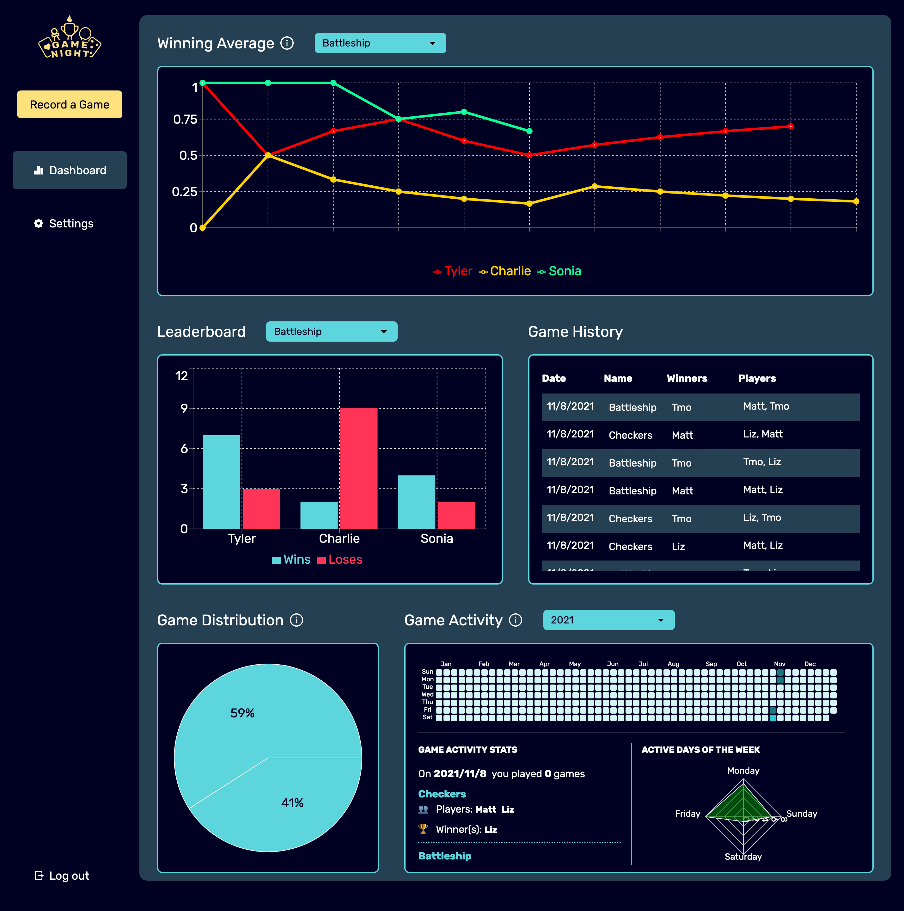

# GameNight

GameNight is a web app that records & analyzes group game nights without the hassle of tracking everything by hand with pencil and paper.

 

 

## 📖 Background

Having watched my family record countless domino games by hand with post-it notes and scratch pads, and seeing their struggle in organizing and tracking their games, I decided to upgrade their form of record-keeping to an online platform.

In addition to tracking games by hand, the issue of recording who won became an issue. While physical pieces of paper have finite space to write, an online application does not have to conform to those limitations and can record much more data as well as display connections between their data as charts and graphs in a visual format.

This began the month-long push of creating GameNight.

## 🏆 Goals

The two main goals of this project are to:

1. Learn about serverless architecture
2. Create a useful product that can be used in the real world.

Specifically, I want to do a deep dive into AWS products such as Amplify, Cognito, and Dynamo DB as well as learn more about GraphQL.

## ⚙️ How GameNight Works

A group, defined as a family unit or collection of friends, can create a single account to track their entire group. Within this account, anyone can add members, games, and/ or record a game. This single account login allows any member at any time the freedom to edit the account. The idea behind this is that, while there may be multiple players who play a game, there only needs to be one player to record the game. This eliminates the need for every player to update the account and saves time.

Once members and games are added, a game can be recorded, and then the dashboard page will populate with data.

All users has their own collection of memmbers, games, and games played. This process is handled through user authenticaiton that filters data per account.

## 🛠 Features

- 🏗 **Create** and edit members and games to your account
- ✍️ **Record** every game you play
- 📊 **Analyze** data from recorded games in visual graphs and charts

The analysis is the most interesting feature due to the endless possibilities of data visualization. Currently, GameNight offers four views of analysis:

- **Game History**: A table view listing each recorded game
- **Leaderboard**: A bar chart listing the number of wins and losses each player has per game
- **Game Distribution**: A pie chart depicting the fractions of games played
- **Game Activity**: A heatmap showcasing how often games are played by anyone in the group

## 💻 Tech Stack

| Front End      | Backend                           | Packages       |
| -------------- | --------------------------------- | -------------- |
| React/ Next js | AWS Amplify (Hosting & CI/CD)     | Recharts       |
| Tailwind css   | AWS Cognito (User Authentication) | Framer Motion  |
|                | AWS Dynamo DB (Database)          | Formik (Forms) |
|                | GraphQL (API)                     |                |

## 🔮 Future Features

1. **Blog**
   Due to the statistical nature of this website, I want to include a blog feature that explains in-depth the statistics that are included. For example, if a user is confused about what exactly the heatmap is, they can click the info button and be directed to the blog entry to explain what that means.

2. **User Feedback Section**
   In order to better deliver what users want, I want to include a simple way for users to ask for what they want to see added or modified to the website.

# 👥 Contributing

I'm glad you are considering contributing to this project. I've poured a ton of hours into this and I would love to see any of your additions. Please read the following to make contributing easier for both you and me.

_Note_: You shouldn't need to install or setup any AWS services.
_Note_: When you are prompted to sign in, use the following credentials:

- username: testaccount
- password:qwerty123

Feel free to edit this account as you see fit to complete your contribution.

If you have any issues logging in, please let me know.

## Step 1: Creating a branch

If you see an issue that sparks your interest or if you would like to contribute something else please follow this guide:

### Branch Structure

- Branches should follow this format
  - `feature/name-of-branch` (a new feature that is being made)
  - `update/name-of-branch` (an update to an existing feature)
  - `bug/name-of-branch` (a bug fix)

## Step 2: Create a PR

Once you are happy with your branch, submit a PR with comments and a descripting documenting what you changed.

When I get the notification that you submitted a PR, I will review the PR and if there are no errors, merge it into main. If however, there are errors, I will provide you with what errors exist so you can fix them.
